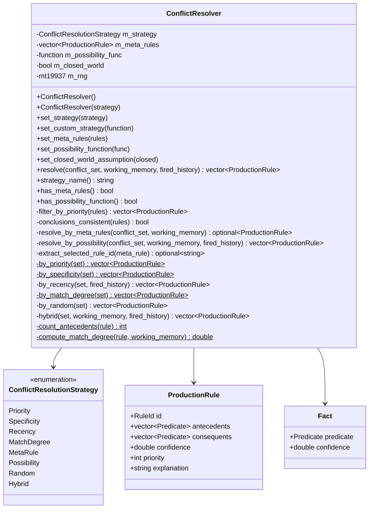
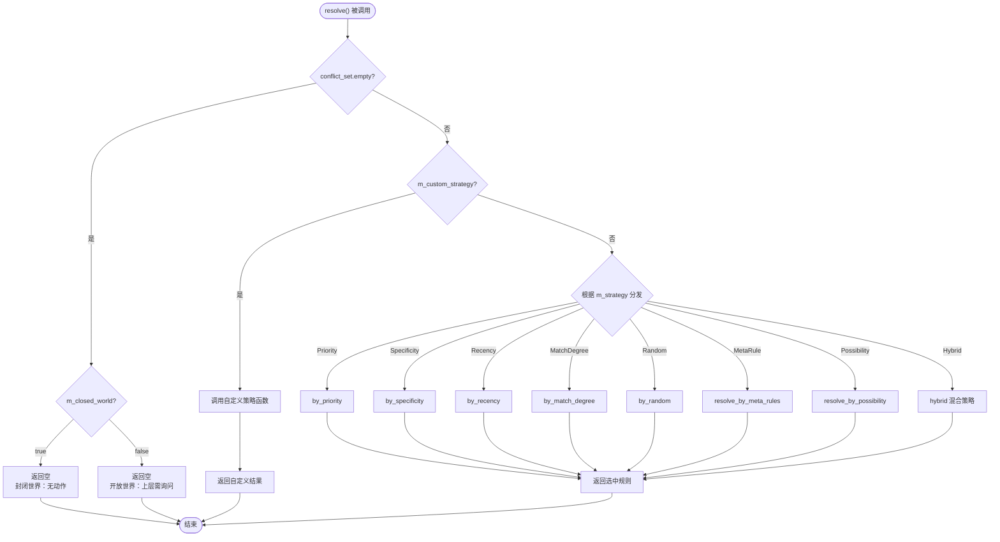
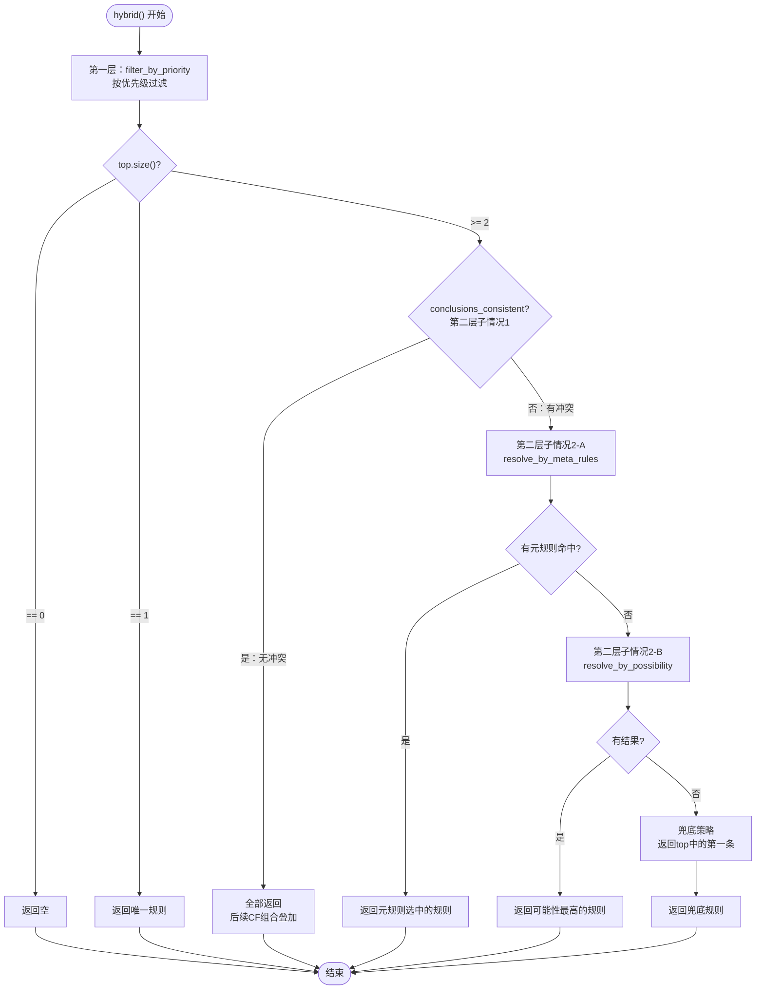

# 冲突消解

## 1. 概述

当**多条规则同时匹配**工作内存中的事实时，ConflictResolver 负责决定**哪条（或哪些）规则被触发**。

---

## 2. 策略详解

### 2.1 第0层：无规则匹配

当没有任何规则的前提与工作内存匹配时，说明知识库（KB）无法覆盖当前情况。

| 假设 | 行为 | 适用场景 |
| ------ | ------ | --------- |
| **封闭世界假设**（默认） | 无动作，推理结束 | 系统要求保守决策，避免误判 |
| **开放世界假设** | 返回空结果，上层触发询问 | 系统允许与用户交互，补充信息 |

```cpp
resolver.set_world_assumption(WorldAssumption::Closed);   // 默认
resolver.set_world_assumption(WorldAssumption::Open);
```

### 2.2 第1层：优先级过滤

每条规则都有一个 `priority` 字段（整数，越大优先级越高）。ConflictResolver 只保留优先级最高的规则。

```cpp
// 规则示例
ProductionRule rule_high;
rule_high.priority = 100;   // 高优先级

ProductionRule rule_low;
rule_low.priority = 10;     // 低优先级
// 推理时只会考虑 rule_high
```

### 2.3 第2层：结论一致性检查

如果最高优先级的规则有多条，则需要检查它们的结论是否一致：

| 情况 | 判定 | 处理方式 |
| ------ | ------ | --------- |
| **结论一致** | 所有规则的结论指向相同的事实 | 全部触发，后续通过 CF 组合叠加 |
| **结论冲突** | 不同规则指向不同/相反的事实 | 进入第3层裁决 |

```cpp
// 一致示例：两条规则都推荐考研
Rule1: IF GPA_high AND interest_research → recommend_postgraduate
Rule2: IF teacher_recommend → recommend_postgraduate
// 结论相同 → 两条都触发，CF叠加

// 冲突示例：一条推荐考研，一条推荐就业
Rule1: IF GPA_high → recommend_postgraduate
Rule2: IF family_needs_income → recommend_job
// 结论不同 → 需要裁决
```

### 2.4 第3层：裁决策略

**策略A**：元规则（Meta-Rule）
元规则是关于规则的规则，它本身不直接产生业务结论，而是用来决定在规则冲突时应该选哪条规则。

```cpp
// 元规则示例：如果家庭经济困难，优先选择推荐就业的规则
// 前提：financial_difficulty
// 结论：SELECT_RULE("R2")  → 表示选择规则ID为 "R2" 的规则

ProductionRule meta_rule;
meta_rule.id = "META1";
meta_rule.antecedents = {Predicate{"financial_difficulty", {}}};
meta_rule.consequents = {Predicate{"SELECT_RULE", {Term{Term::Type::Constant, "R2"}}}};
meta_rule.priority = 999;   // 元规则优先级必须高于普通规则
```

元规则优势：可解释性强，业务人员可以直接编写和维护。

**策略B**：可能性（Possibility）
通过一个评估函数计算每条规则的得分，选择得分最高的规则。

```cpp
// 设置可能性评估函数
resolver.set_possibility_function(
    [](const ProductionRule& rule, 
       const std::unordered_set<Fact>& facts, 
       const std::unordered_set<RuleId>& history) -> double {
        // 计算规则匹配度作为得分
        int matched = 0;
        for (const auto& ant : rule.antecedents) {
            for (const auto& fact : facts) {
                if (ant.name == fact.predicate.name) {
                    matched += fact.confidence > 0.5 ? 1 : 0;
                }
            }
        }
        return rule.antecedents.empty() ? 0.5 : matched / rule.antecedents.size();
    }
);
```

可能性评估优势：灵活，可以结合任意上下文信息（用户画像、历史记录、实时数据）。

---

## 3. 类图



---

## 4. 决策流程图

### 4.1 完整 resolve() 流程



### 4.2 Hybrid 混合策略详细流程



---

## 5. 决策矩阵

| 层次 | 判断条件 | 策略 | 代码入口 | 返回值 |
| :---: | :--- | :--- | :--- | :--- |
| **第0层** | `conflict_set.empty()` | 封闭世界：无动作；开放世界：询问用户 | `resolve()` 开头 | `{}` |
| **第1层** | 有冲突集 | 按 `priority` 取最高 | `filter_by_priority()` | 过滤后的规则集 |
| **第2层** | 优先级相同 | 检查结论是否一致 | `conclusions_consistent()` | `true` / `false` |
| **第2.1层** | 一致 | 无冲突，叠加 | `resolve()` 直接返回全部 | 全部规则 |
| **第2.2层** | 不一致 | 进入裁决 | 进入第3层 | - |
| **第3层** | 有元规则 | 策略A：元规则 | `resolve_by_meta_rules()` | 元规则选中的规则 |
| **第3层** | 有可能性函数 | 策略B：可能性 | `resolve_by_possibility()` | 得分最高的规则 |
| **第3层** | 两者都无 | 兜底 | `hybrid()` 末尾 | `top[0]` |

---

## 6. 使用示例

### 6.1 基础用法

```cpp
#include "conflict/ConflictResolver.hpp"

using namespace expert;

ConflictResolver resolver;

// 设置策略
resolver.set_strategy(ConflictResolutionStrategy::Priority);

// 设置世界假设（默认 Closed）
resolver.set_world_assumption(WorldAssumption::Closed);

// 执行消解
auto selected = resolver.resolve(conflict_set, working_memory, fired_history);
```

### 6.2 使用元规则

```cpp
// 创建元规则：经济困难 → 选择推荐就业的规则
ProductionRule meta_rule;
meta_rule.id = "META1";
meta_rule.antecedents = {Predicate{"financial_difficulty", {}}};
meta_rule.consequents = {Predicate{"SELECT_RULE", {Term{Term::Type::Constant, "R2"}}}};
meta_rule.priority = 999;

// 注册元规则
resolver.set_meta_rules({meta_rule});

// 当规则 R1（推荐考研）和 R2（推荐就业）冲突时，
// 如果工作内存中有 financial_difficulty，则会选择 R2
```

### 6.3 使用可能性函数

```cpp
// 自定义可能性评估函数
resolver.set_possibility_function(
    [](const ProductionRule& rule, 
       const std::unordered_set<Fact>& facts,
       const std::unordered_set<RuleId>& history) -> double {
        
        // 计算规则的历史触发次数（次数越少越优先）
        int fired_count = history.count(rule.id);
        
        // 计算匹配度
        double match_score = 0.0;
        if (!rule.antecedents.empty()) {
            int matched = 0;
            for (const auto& ant : rule.antecedents) {
                for (const auto& fact : facts) {
                    if (ant.name == fact.predicate.name) {
                        matched++;
                        break;
                    }
                }
            }
            match_score = static_cast<double>(matched) / rule.antecedents.size();
        }
        
        // 组合得分：匹配度优先，历史触发次数作为惩罚
        return match_score - (fired_count * 0.01);
    }
);
```

### 6.4 自定义完全策略

```cpp
// 如果内置策略都不满足需求，可以完全自定义
resolver.set_override_strategy(
    [](const std::vector<ProductionRule>& conflict_set) {
        auto sorted = conflict_set;
        std::sort(sorted.begin(), sorted.end(),
            [](const ProductionRule& a, const ProductionRule& b) {
                return a.id.length() < b.id.length();
            });
        return std::vector<ProductionRule>{sorted.front()};
    }
);
```

---

## 7. 与确定性因子（CF）的协同

冲突消解器与 CertaintyFactor 模块紧密配合：

| 场景 | 冲突消解器职责 | CF模块职责 |
| ------ | -------------- | ----------- |
| 结论一致，多条规则触发 | 返回所有规则 | 使用 `CertaintyFactor::combine()` 组合多条规则的CF |
| 结论冲突，选择一条规则 | 选择胜出的规则 | 使用选中的规则CF作为结论CF |
| 规则触发后 | 记录 `fired_history` | 更新工作内存中事实的CF |

```cpp
// 冲突消解后
auto selected = resolver.resolve(conflict_set, working_memory, fired_history);

// 如果是多条规则（结论一致）
if (selected.size() > 1) {
    CertaintyFactor combined(0.0);
    for (const auto& rule : selected) {
        combined = CertaintyFactor::combine(combined, CertaintyFactor(rule.confidence));
    }
    // combined 即为组合后的CF
}

// 如果是单条规则
if (selected.size() == 1) {
    CertaintyFactor cf(selected[0].confidence);
    // 使用 cf
}
```
