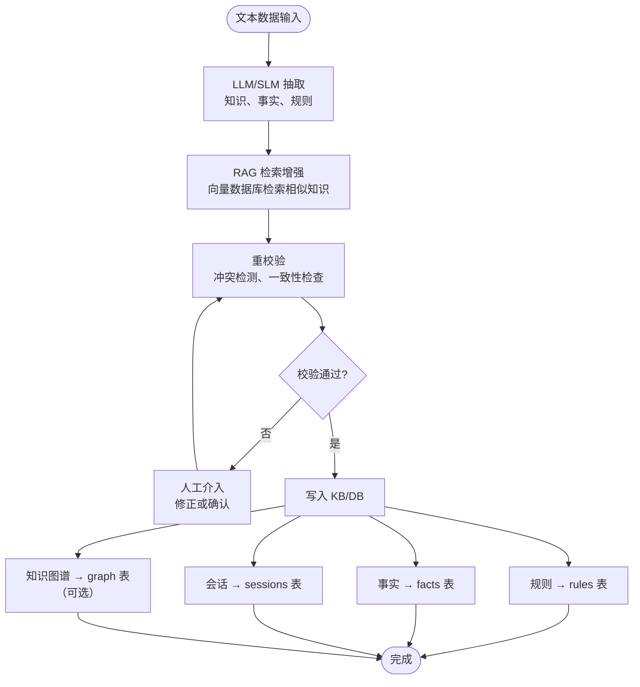

# 数据处理与知识注入流程

> 本仓库仅接收并处理文本数据，非文本数据的预处理由上游独立模块负责。

## 1. 数据类型与业界处理方法

| 数据类型 | 业界主流处理方法 (Modern Best Practices) | 备注 / 常见模型架构 |
| :--- | :--- | :--- |
| 图像数据 | Vision Transformer (ViT)、多模态大模型 (VLM)、CNN | CLIP, Swin-T, YOLOv8, Qwen-VL |
| 音频数据 | Transformer (ASR/TTS)、扩散模型 (Diffusion) | Whisper, Conformer, Bark |
| 数值序列数据 | 梯度提升树 (GBDT)、时间序列 Transformer | XGBoost, PatchTST, Temporal Fusion Transformer |
| 表格/结构化数据 | 树模型 (GBDT)、表格 Transformer、LLM 结构化抽取 | LightGBM, XGBoost, FT-Transformer |
| 文本数据 | Transformer (LLM / SLM / Embedding 模型) | Llama 3, Qwen 2.5, BERT, BGE |
| 配置与标记数据 | 文本解析器 (Parser)、AST 语法树解析 | JSON / YAML / TOML 原生解析器 |
| 图 / 树数据 | 图神经网络 (GNN)、图谱数据库引擎、JSON/GraphML 解析 | GCN, GAT, Neo4j, NetworkX |

---

## 2. 数据处理后的输出

各类数据经过对应模型处理后，会产生以下形式的中间结果：

- 日志：系统运行记录
- 可视化结果：图表、图像
- 标记语言结果：JSON、CSV、YAML等

对这些结果的分析路径有三种：

| 分析路径 | 说明 | 适用场景 |
| :--- | :--- | :--- |
| LLM API | 调用云端大模型（如 GPT、Claude） | ☁️ 需要最强推理能力，可联网 |
| 本地 SLM | 调用本地部署的小模型（如 Ollama） | 💻 数据隐私要求高，离线环境 |
| 人类专家 | 人工分析，注入专业领域知识 | 🧠 需要行业经验或主观判断 |

这些中间结果的分析过程与结论最终均以文本（Markdown / JSON / 自然语言报告）的形式呈现。不论是云端 LLM、本地 SLM 提取的分析文本，还是人类专家人工撰写的评估报告，均统一作为本系统的文本数据输入（Input）

---

## 3. 本 repo 的数据边界

```text
┌─────────────────────────────────────────────────────────────────┐
│  外部数据（图像/音频/数值序列/表格/树/图/表）                   │
│                        ↓                                       │
│  外部预处理（CNN/RNN/决策树/图谱解析等）                        │
│                        ↓                                       │
│  ┌─────────────────────────────────────────────────────────┐   │
│  │              📄 文本数据（唯一入口）                    │   │
│  │  ┌─────────────┐  ┌─────────────┐  ┌─────────────┐   │   │
│  │  │  日志文本    │  │  分析报告   │  │  结构化描述 │   │   │
│  │  └─────────────┘  └─────────────┘  └─────────────┘   │   │
│  └─────────────────────────────────────────────────────────┘   │
│                        ↓                                       │
│  ┌─────────────────────────────────────────────────────────┐   │
│  │              🔧 本 repo 处理流程                        │   │
│  │  ① LLM/SLM 抽取 → ② RAG 检索增强 → ③ 重校验 → ④ 入库 │   │
│  └─────────────────────────────────────────────────────────┘   │
│                        ↓                                       │
│  ┌─────────────────────────────────────────────────────────┐   │
│  │              💾 KB / DB 写入                            │   │
│  │  规则表  │  事实表  │  会话表  │  知识图谱（可选）    │   │
│  └─────────────────────────────────────────────────────────┘   │
└─────────────────────────────────────────────────────────────────┘
```

---

## 4. 知识注入流程

本 repo 接收文本数据后，执行以下流程：



### 4.1 步骤详解

| 步骤 | 说明 | 组件 |
| :---: | :--- | :--- |
| ① 抽取 | LLM/SLM 从文本中提取结构化知识 | `ingest/extractor.py` |
| ② 检索增强 | 从向量库检索已有知识作为上下文 | `agent/rag/retriever.py` |
| ③ 重校验 | 检测新规则与已有规则的冲突 | `ingest/validator.py` |
| ④ 入库 | 写入 SQLite / Qdrant / 图存储 | `ingest/writer.py` |

---

## 5. 知识图谱的特别处理

对于图数据或树数据，通过一个 bool 参数 is_graph_data 控制行为：

```json
{
    "text": "从图谱中提取的实体关系描述...",
    "is_graph_data": true,
    "graph_json": {
        "nodes": [...],
        "edges": [...]
    }
}
```

当 is_graph_data = true 时：

1. 系统会额外解析 graph_json 中的节点和边
2. 将实体关系存储到知识图谱模块（knowledge_graph/）
3. 图谱中的实体关系会作为 RAG 检索的上下文，辅助后续规则抽取
4. 图谱数据本身不直接产生规则，规则仍然由 LLM 从文本中抽取

注意：图/树数据不直接面向专家系统的推理方法，需要先数据挖掘出序列数据、表格数据或文本数据后，再注入本系统。

---

## 6. 数据流完整示例

以“考研决策”场景为例（假设 KB 中已预置相关推荐规则）：

```text
1. 外部数据：学生背景信息（GPA、学校、兴趣、经济状况）
   → 格式化为文本描述："GPA 3.8，对科研感兴趣，家庭经济尚可"

2. 本 repo 接收文本
   → LLM 抽取事实：GPA_high (cf=0.9)、interest_research (cf=0.8)、family_needs_income (cf=0.5)

3. 校验：将提取事实代入已有规则进行冲突检测
   → 已有规则 R1: GPA_high + interest_research → recommend_postgraduate
   → 已有规则 R2: family_needs_income → recommend_job
   → 检测到结论冲突（推荐考研 vs 推荐就业），触发人工介入确认权重

4. 写入 KB/DB（专家确认后）：
   - 事实表：写入本次抽取的 GPA_high、interest_research 等事实
   - 规则表：如有新抽取的逻辑则写入 rules 表
   - 会话表：记录本次推理与校验过程
```

---

## 7. 代码模块映射

| 文档中的概念 | 代码模块 | 上游依赖 |
| :--- | :--- | :--- |
| 文本数据接收 | `api/main.py` — `/ingest` 接口 | — |
| LLM/SLM 抽取 | `ingest/extractor.py` | 接收层 |
| RAG 检索增强 | `agent/rag/retriever.py` | 抽取层 + 向量库 |
| 重校验 | `ingest/validator.py` | 抽取层 + 规则存储 |
| 写入 KB | `ingest/writer.py` | 校验层 |
| 规则存储 | `knowledge/rules.py` | 写入层 |
| 事实存储 | `knowledge/facts.py` | 写入层 |
| 会话存储 | `knowledge/sessions.py` | 写入层 |
| 知识图谱存储 | `knowledge/graph_db/` | 写入层（可选） |
| 向量数据库 | `knowledge/vector_db/` | 检索层 + 写入层 |

---

## 8. 总结

### 数据层

| 方面 | 结论 |
| :--- | :--- |
| 数据接收范围 | ✅ 仅限文本数据（Text Data Only） |
| 非文本数据 | ❌ 需由上游模块（Upstream）预处理为文本后输入 |

### 抽取层

| 方面 | 结论 |
| :--- | :--- |
| 知识抽取方式 | LLM API / 本地 SLM |
| 知识图谱 | 通过 `is_graph_data` 参数可选启用 |

### 存储层

| 方面 | 结论 |
| :--- | :--- |
| 知识存储方式 | SQLite（规则/事实/会话）+ Qdrant（向量）+ 图存储（可选） |
